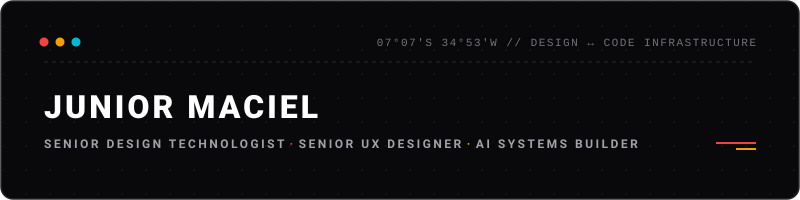

  

Senior Design Technologist, UX Designer, and AI Systems Builder based in João Pessoa, Brazil (Remote).

Bridging the gap between design systems architecture, frontend engineering, and AI-driven tooling.

## About

Over the past decade, I have focused on designing and engineering scalable digital products, building robust design-to-code pipelines, and establishing productive alignment between designers and engineers.

- **Enterprise & Governance:** Senior Design Technologist at **Philips**, driving Design Systems governance, design-to-code integration, and frontend architecture across complex healthcare platforms.
- **Venture & Tooling:** Founder at **LENX & Co.**, an independent studio engineering autonomous design-to-code operating systems, token compilers, and AI-augmented tooling for high-velocity teams.

## Focus Areas

- **Design Systems & Tokens** — W3C DTCG specification, 3-tier token architecture, multi-theme/dark mode, Tokens Studio, Storybook, and Figma APIs.
- **Frontend Architecture** — TypeScript, React, Next.js, Tailwind CSS, headless UI patterns, and accessibility standards (WCAG 2.2).
- **Tooling & AI Automation** — Node/TypeScript CLIs, Google Gemini multimodal integrations, Model Context Protocol (MCP), and automated design QA.

## LENX & Co.

Infrastructure and tooling currently in development:

- `@lenx/tools` *(CLI Suite · In Active Development)* — Global Design Ops CLI for agnostic token compilation (W3C DTCG → CSS/Tailwind/TS), live multimodal meeting transcription via Google Gemini, and media pipelines.
- `lenx-brand` *(Design System & Next.js · In Active Development)* — High-contrast visual language, multi-tier token architecture, and canonical brand system (lenxco.com).
- `lenx-skills` *(AI Engine & Playbook · Internal Core)* — Guided step-by-step methodology powered by portable multi-agent skill packs.

## Stack & Tooling

TypeScript · React · Next.js · Tailwind CSS · Node.js · Storybook · Figma · Tokens Studio · Google Gemini API · Git

## Contact

- [LinkedIn](https://www.linkedin.com/in/juniordesigner/)
- [Email](mailto:juniormacieldg@gmail.com)

